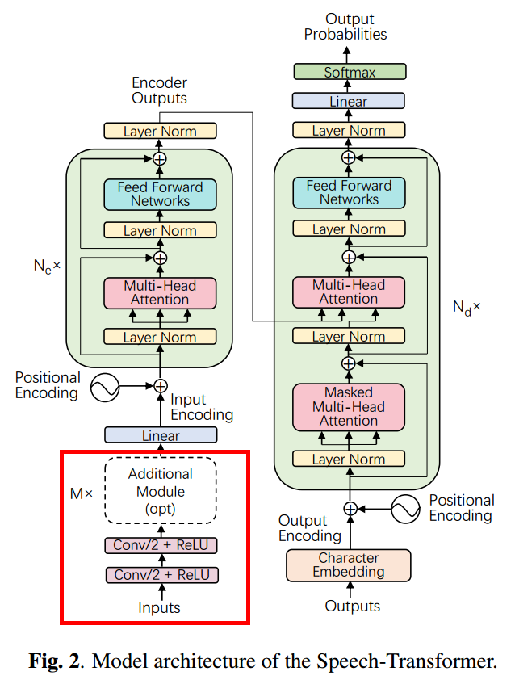
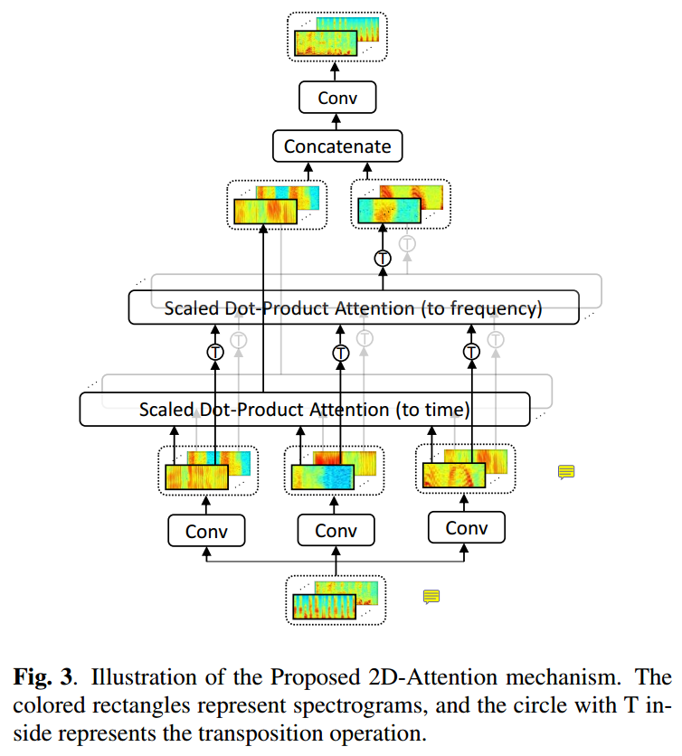
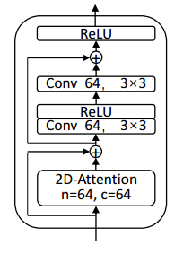

# ASR-Transformer-plus-2DAttention
A pytorch implementation of Speech Transformer [1], an end-to-end automatic speech recognition with [Transformer](https://arxiv.org/abs/1706.03762) [4] network, which directly converts acoustic features to character sequence using a single nueral network.
ps: 2DAttention only used for feature extraction and down-sampling , more details can be found in paper[1]

## Install
- Python3 (recommend Anaconda)
- pytorch 1.0 -

## Dataset
- **aishell**: aishell is a corpus of approximately 150 hours of 16kHz chinese speech.

## Model
- **model_architecture**

- **input**: The input acoustic features were 80-dimensional filterbanks extracted with a hop size of 10ms and a window size of 25ms, extended with temporal first and second order differences and per-speaker mean subtraction and variance normalization.
- **output**: The output alphabet of target text consisted of 4233 chinese syllable classes, include unknown tokens, start-of-sequence tokens and end-of-sequence tokens.
- **2D-attention**: described in [1]

- **pre_net**: described in [1]

## Reference
- [1] Linhao Dong, Shuang Xu,and Bo Xu. “Speech-transformer:A no-recurrence sequence-to-sequence model for speech recognition” in ICASSP 2018
- [2] Transformer model for language understanding.  See [transformer tutorial](https://www.tensorflow.org/alpha/tutorials/text/transformer)
- [3] A PyTorch implementation of Speech Transformer. See [speech transformer pytorch](https://github.com/kaituoxu/Speech-Transformer)
- [4] Ashish Vaswani, Noam Shazeer, et al. “Attention is all you need” in NIPS 2017

